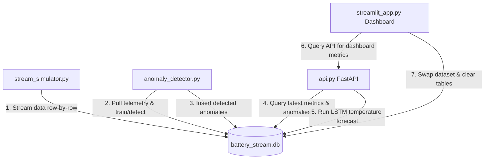

# EV Battery Diagnostics & Telemetry Platform

An industry-ready, real-time electric vehicle (EV) battery analytics and diagnostics dashboard. The system integrates unsupervised anomaly detection (using Isolation Forest) and deep learning thermal forecasting (using LSTM cells) to monitor cells, predict thermal runaways, and diagnose degradation across different battery chemistry profiles.

---

## ⚡ Architecture Overview

The platform uses a decoupled three-tier service architecture designed for high-frequency telemetry streams:



1. **Stream Simulator (`stream_simulator.py`):** Acts as the hardware CAN bus emulator, feeding cycle summaries into the SQLite database.
2. **Anomaly Detector (`anomaly_detector.py`):** Runs out-of-process to pull telemetry, fit the Isolation Forest model, and flag anomalies.
3. **Diagnostics API (`api.py`):** A FastAPI server that exposes REST endpoints for latest telemetry, anomaly counts, and triggers the LSTM thermal forecasting.
4. **Monitoring Dashboard (`streamlit_app.py`):** A Streamlit application built with high-fidelity glassmorphism, responsive grids, and interactive Plotly visuals.

---

## 🌟 Extensive Features

### 1. Interactive SCADA Dashboard UI/UX
- **Modern Design:** Slate-dark theme (`#0B0F19`) featuring premium typography (Plus Jakarta Sans) and responsive fluid grid layouts.
- **Glassmorphic Indicators:** Semi-transparent widgets with glowing border accents. Card colors dynamically shift based on safety levels (e.g., green for healthy SOH, amber/red for thermal alerts).
- **Centered Upload System:** A centered and clean drag-and-drop file uploader for importing custom battery CSV profiles.

### 2. Dataset Control Center (Kaggle NASA Datasets)
- **Kaggle Datasets Imported:** Pre-extracted and aggregated cycle-level profiles for 4 popular NASA Ames battery tests inside the `Sample data/` directory:
  - **NASA Battery B0005:** Baseline degradation run at 24°C.
  - **NASA Battery B0006:** Degradation profile with a lower voltage cutoff (2.5V vs 2.7V).
  - **NASA Battery B0007:** Accelerated degradation profile with a lower voltage cutoff (2.2V).
  - **NASA Battery B0018:** Accelerated degradation profile with irregular cycle profiles.
- **Seamless Swap & Reset:** Loading any dataset automatically clears historical SQLite database logs and deletes older ML checkpoints, preventing data overlap.

### 3. Real-Time Telemetry Overlay Plots
- High-fidelity charts for **Terminal Voltage**, **Cell Temperature**, **Measured Current**, and **Capacity Fade**.
- Unsupervised anomalies flagged in real-time by the Isolation Forest are marked as hollow **RED** alert markers directly on the streaming line plots.

### 4. Self-Learning ML Backend & Thermal Forecasting
- **Isolation Forest Outliers:** Unsupervised model automatically trains as soon as the simulator logs 100 points. Uses a contamination boundary ($5\%$) to isolate electrical or thermal outliers.
- **LSTM Recurrent Neural Network:** Predicts next-step cell temperature. Reads a sliding sequence of the last 10 sequential readings ($X_{seq} = [T_{t-9}, \dots, T_t]$) to forecast $y = T_{t+1}$.
- **FastAPI Background Training:** Swapping datasets resets the models. Once 50 new points stream into the DB, requesting a prediction triggers automatic model training on FastAPI background threads.
- **Thermal Forecast Chart:** Compares actual cell temperature with LSTM-predicted temperature, displaying the **Mean Absolute Error (MAE)**.

---

## 📁 Repository Directory Structure

```
ev-battery-platform/
├── dashboard/
│   └── streamlit_app.py        # Streamlit premium SCADA application
├── data/
│   ├── cleaned_dataset/        # Raw NASA dataset cycle files (Git ignored)
│   └── battery_stream.db       # SQLite local database (Git ignored)
├── models/
│   ├── isolation_forest.pkl    # Trained Isolation Forest model (Git ignored)
│   └── lstm_temp.h5            # Trained LSTM network weights (Git ignored)
├── Sample data/
│   ├── NASA_Battery_B0005.csv  # Extracted B0005 cycle summary dataset
│   ├── NASA_Battery_B0006.csv  # Extracted B0006 cycle summary dataset
│   ├── NASA_Battery_B0007.csv  # Extracted B0007 cycle summary dataset
│   └── NASA_Battery_B0018.csv  # Extracted B0018 cycle summary dataset
├── src/
│   ├── anomaly_detector.py     # Isolation Forest background detection loop
│   ├── api.py                  # FastAPI server with background task training
│   ├── extract_sample_data.py  # Aggregator script compiling raw NASA cycles
│   ├── lstm_forecaster.py      # LSTM sequential preparation, training, & forecast
│   └── stream_simulator.py     # SQLite streaming simulator
├── requirements.txt            # Python dependencies
└── README.md                   # Platform documentation
```

---

## 🚀 Setup & Execution Guide

### 1. Prerequisites & Installation

Verify that Python 3.9+ is installed. Clone the repository and install dependencies inside a virtual environment:

```bash
# Initialize virtual environment
python -m venv venv
venv\Scripts\activate

# Install dependencies
pip install -r requirements.txt
```

### 2. Running the Services

To stream telemetry and view the dashboard in real-time, execute the following commands in separate terminals (ensure your virtual environment is active in all):

**Step 1: Start the FastAPI Server**
```bash
uvicorn src.api:app --host 127.0.0.1 --port 8000 --reload
```

**Step 2: Start the Anomaly Detector Service**
```bash
python -m src.anomaly_detector
```

**Step 3: Start the Telemetry Stream Simulator**
```bash
python -m src.stream_simulator
```

**Step 4: Launch the Streamlit Monitoring Dashboard**
```bash
streamlit run dashboard/streamlit_app.py
```

---

## 🔄 Dataset Swapping Workflow

When switching datasets (e.g., from B0005 to B0007) via the sidebar:
1. The dashboard copies the selected dataset to `data/Battery.csv`.
2. It truncates `battery_telemetry` and `anomalies` SQLite database tables.
3. It deletes `models/isolation_forest.pkl` and `models/lstm_temp.h5`.
4. **Simulator Restart:** Stop your `stream_simulator.py` script (`Ctrl+C`) and run it again.
5. **Auto-Training:** The anomaly detector and API will train fresh models on the fly once the stream registers 100 points (Isolation Forest) and 50 points (LSTM) respectively.
